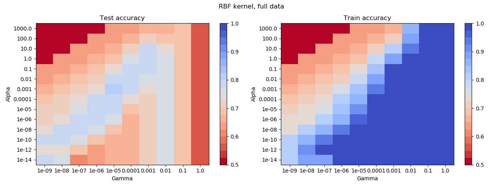

# ICTUS Dataset Analysis

The dataset shows an interesting phenomenon:
 - Very simple neural networks have great performance (see file `nn_weights_experiments/neural_test.py` for experiment details) > 95%
 - Kernel methods not so good performance (see image below for an example with the rbf kernel)

A bunch of different analysis have been performed to try to understand the phenomenon. The different attempts are grouped in jupyter notebooks:
 - [Distance matrix analysis](DataDistance.ipynb) : looking at the distance matrix between data points and between neural-network centers -- data-points
 - [Matching pursuit](MatchingPursuit.ipynb) : implements and runs kernelized mathcing pursuit and Lasso.
 - [NN projection](nn_weights_experiments/Projected prediction experiment.ipynb) : implements KRR on top of the data projected on the neural-network centers.
 - [Miscellaneous models and analyses](FalkonPredict.ipynb)

### Running the notebooks

Needs access to:
 1. The dataset
 2. Other miscellaneous pieces of code, such as an implementation of falkon (necessary for running certain experiments).

